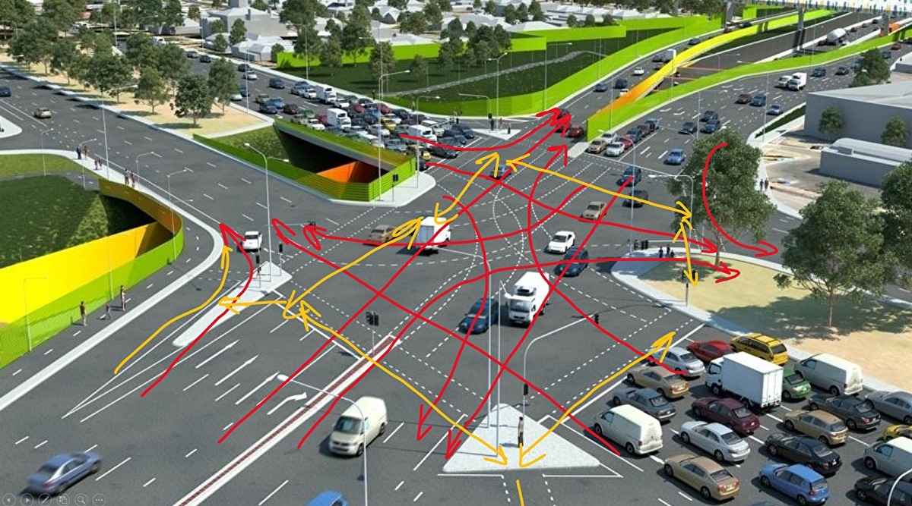
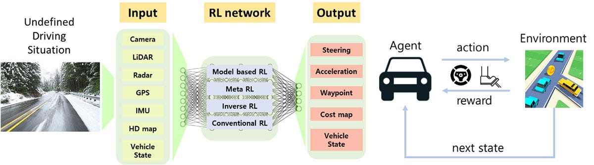

# Traffic Management System using Graph Neural Networks and Reinforcement Learning
===========================================================

## Overview
-----------

This project presents a novel approach to traffic management using machine learning, combining computer vision, graph neural networks, and reinforcement learning to optimize traffic signal timings and reduce traffic congestion.

## System Components
--------------------

### 1. Traffic Monitoring System

* Uses computer vision to analyze live camera feeds and detect traffic congestion
* Utilizes OpenCV to process video feeds and detect the number of vehicles in each lane

### 2. Graph Neural Network

* Models the traffic network and predicts traffic congestion using a graph neural network
* Implemented using PyTorch Geometric library

### 3. Reinforcement Learning Agent

* Optimizes traffic signal timings using reinforcement learning
* Utilizes the FRAP algorithm to learn the optimal traffic signal timings

## How it Works
----------------

### Step 1: Traffic Monitoring

The traffic monitoring system uses computer vision to analyze live camera feeds and detect traffic congestion.

### Step 2: Graph Neural Network

The graph neural network models the traffic network and predicts traffic congestion.

### Step 3: Reinforcement Learning

The reinforcement learning agent optimizes traffic signal timings using the FRAP algorithm.

## System Architecture
---------------------
                                  +---------------+
                                  |  Camera Feeds  |
                                  +---------------+
                                         |
                                         |
                                         v
                                  +---------------+
                                  |  Traffic Monitoring  |
                                  |  (Computer Vision)    |
                                  +---------------+
                                         |
                                         |
                                         v
                                  +---------------+
                                  |  Graph Neural Network  |
                                  |  (Traffic Network Modeling) |
                                  +---------------+
                                         |
                                         |
                                         v
                                  +---------------+
                                  |  Reinforcement Learning  |
                                  |  (Traffic Signal Optimization) |
                                  +---------------+
----------------------

## Getting Started
-------------------

### Prerequisites

* Python 3.7+
* OpenCV 4.5+
* PyTorch 1.9+
* PyTorch Geometric 2.0+
* FRAP library

### Installation

1. Clone the repository: `git clone https://github.com/your-username/traffic-management-system.git`
2. Install the required libraries: `pip install -r requirements.txt`
3. Run the system: `python main.py`

## Results
----------

The system has been tested on a simulated traffic network and has shown promising results in reducing traffic congestion.

## Future Work
--------------

* Integrate the system with real-world traffic data
* Improve the graph neural network architecture for better traffic prediction
* Experiment with other reinforcement learning algorithms for traffic signal optimization

## License
---------

This project is licensed under the MIT License. See [LICENSE](LICENSE) for details.

## Acknowledgments
----------------

* This project was inspired by the work of Ritesh Godse on traffic signal control using reinforcement learning.
* The FRAP algorithm was implemented based on the paper "FRAP: A Flexible Reinforcement Learning Algorithm for Traffic Signal Control" by Ritesh Godse.

## Contributors
--------------

* Ritesh Godse: Developed the traffic management system using graph neural networks and reinforcement learning.

